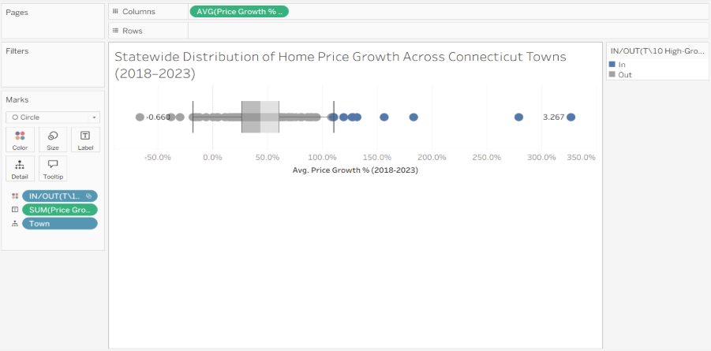
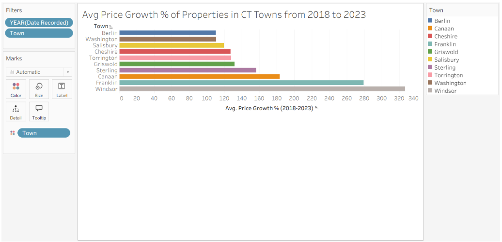
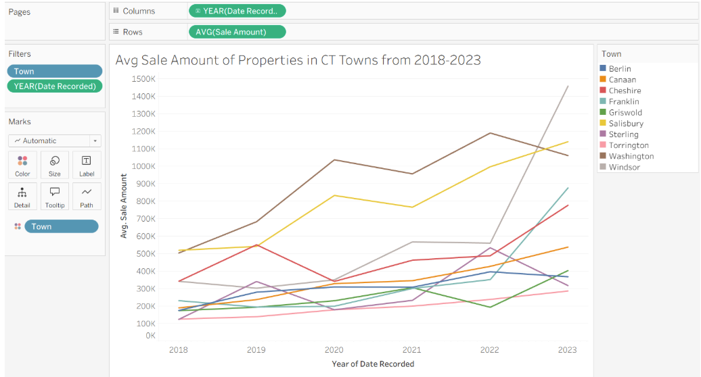
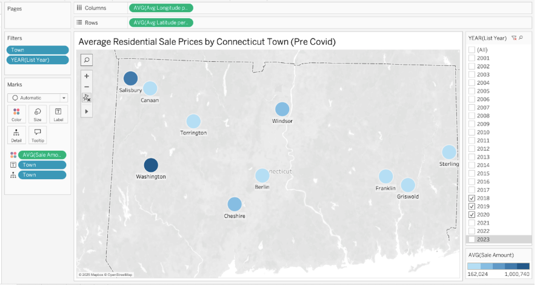
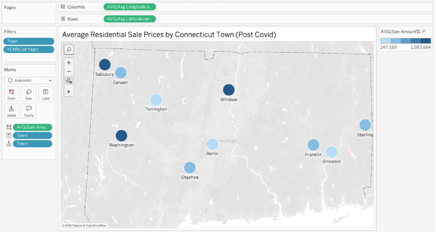
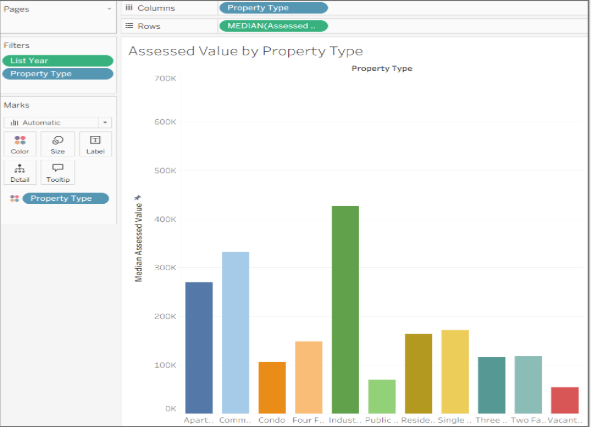
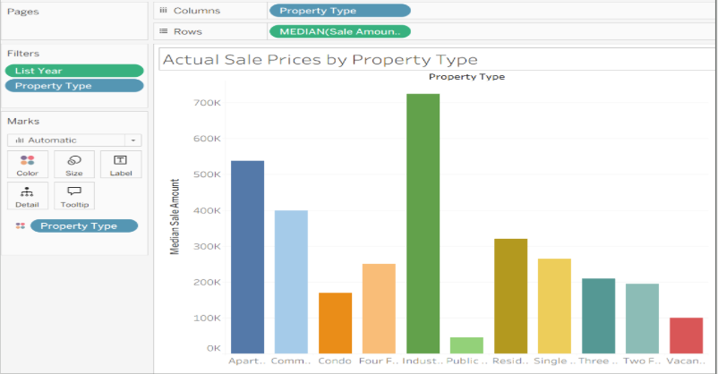
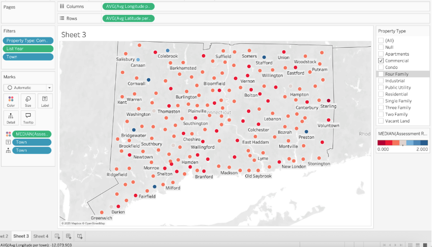
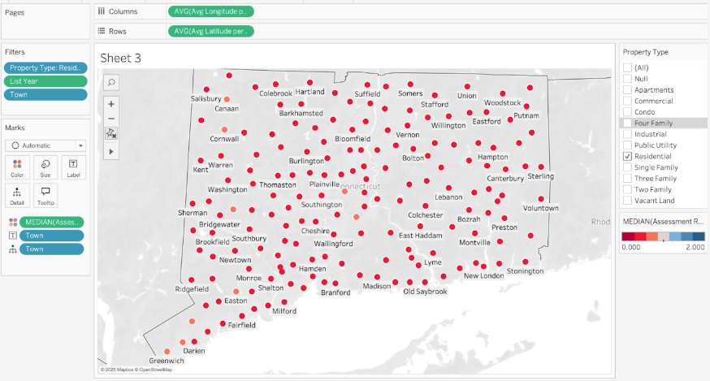
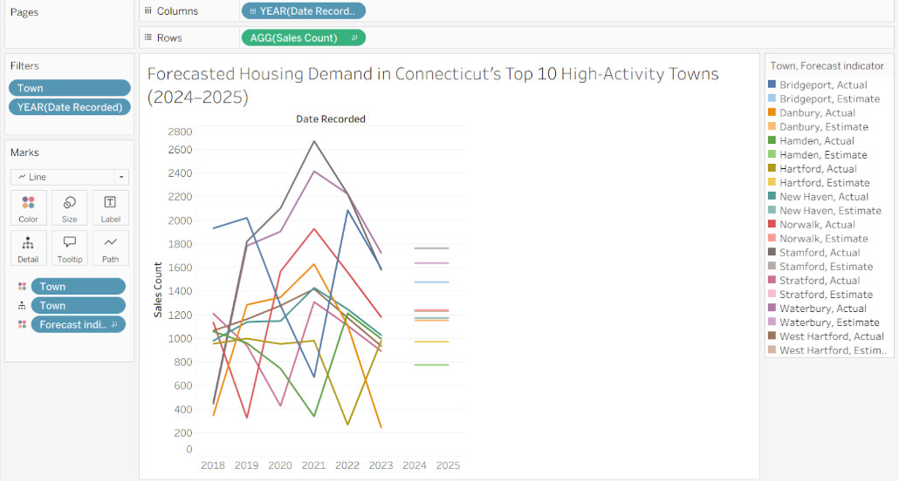

# mist4610-project2-group-7

## Team Name:
15058 Group 7

## Team Members:
1. Tyler Schildkraut [@tylerschildkraut](https://github.com/tylerschildkraut)
2. Angela Ren [@angelaaa456](https://github.com/angelaaa456)
3. Sammy Effron [@seffron](https://github.com/seffron)
4. Audrey Staples [@audreystaples](https://github.com/audreystaples)
5. Tanner Sutherland [@tannersutherland](https://github.com/tannersutherland)

## Data Set Overview
We chose the data model title Real Estate Sales 2001-2023 GL. Specifically, our data was collected from the state of Connecticut and we have narrowed our focus more specifically on the past decade or so of housing prices. It included exactly 1,141,722 rows of values along with 14 columns in total so we really wanted to make sure we narrowed down our filters and the scope of our analysis. The reason we chose this data set was because we were curious about trends in recent years as the housing market is always a great indicator of market health. Additionally, our data set is rich in values that people can understand. Some of the most relevant data we were able to get plenty of information on were the following: Serial Number, List Year, Town, Address, Assessed Value, Sale Amount, Sales Ratio, Property Type, and Residential Type. Other data included in the database included Date Recorded, Non Use Code, Assessor Remarks, OPM Remarks, and Location. However, we made the decision to not include analysis of these values because they were redundant, not extremely intuitive, and we found we could provide better insights using other data points specified in the model. Serial Number (whole number data type) specifies the unique label placed on each individual house in the state of Connecticut. List Year (whole number data type) specifies the year the house was listed on the market and Data Recorded (date data type) is the specific date the property was registered under a specific mortgage/deed. Town (string data type) and Address (string data type) included information about where the house was located. Assessed Value (decimal number data type) and Sales Amount (decimal number data type) allowed us to examine the difference between what the value of the house was assessed to be by appraisers versus the amount the house actually sold for on the market. The Sales Ratio (decimal number data type) provides a specific ratio that details the discrepancies between Assessed Value and Sales Amount. For example, a ratio below 1.0 would be indicative of a property being under-assessed versus a ratio above 1.00 indicating the property is being over-assessed. Property Type (string data type) indicates the specific property type (Residential, Commercial, Vacant Land, etc.). Residential Type (string data type) specifies the specific residential property type given that the property is considered Residential (Single Family, Two Family, Condo, etc.). Non-Use Code (string data type) specifies information regarding a property if it was regarded as not conforming property contractual obligations. Assessor Remarks (string data type) specifies official remarks given by a property assessor for tax purposes, and OPM Remarks (string data type) includes information regarding if a property was financed by an outside source other than the purchaser’s own funds. Lastly, Location (string data type) provides the exact GPS coordinates of a specific property.

---

## Question 1: Analytical  
**How did average prices across Connecticut towns change from 2018–2023, especially during and after the COVID-19 housing surge?**

This question is important because the 2018–2023 period captures one of the most significant housing market disruptions in modern history. COVID-19 triggered sudden migration shifts, remote work arrangements, historically low interest rates, and widespread inventory shortages, all of which dramatically altered housing demand. Analyzing how prices evolved across towns provides insight into which markets were most affected and how different parts of the state responded to the same macroeconomic shock. Understanding these uneven effects is valuable for policymakers, real estate professionals, and researchers interested in long-term affordability trends.

To begin the analysis, we calculated the percentage change in average sale amounts for each of Connecticut’s 169 towns between 2018 and 2023. This statewide distribution provides context for evaluating both typical and extreme growth patterns. We then isolated the top 10 fastest-growing towns to examine how their behavior differed from the statewide norm. By pairing bar charts, line charts, and geographic maps, we were able to analyze not only overall growth but also year-over-year momentum and pre- vs. post-COVID differences.

### Plot 1: Statewide Price Growth Distribution  

**Description and Results:**  
The statewide box-and-whisker plot shows that the median town in Connecticut grew approximately 45% between 2018 and 2023, while most towns fell between 20% and 70% growth. However, the plot also highlights a set of extreme outliers—towns that grew between 150% and 325%. These high-growth towns stand far above the statewide distribution and reveal how unevenly the COVID housing boom affected the state. While most towns experienced moderate appreciation, a select group surged at three to six times the typical rate. This validates the decision to examine the top 10 towns individually, as they represent fundamentally different market behavior.

### Plot 2: Top 10 Fastest-Growing Towns  
!

**Description and Results:**  
This bar chart highlights the towns with the largest percentage increases in average sale price. The dramatic variation across these towns suggests that certain local markets experienced intense demand pressure, limited inventory, or strong in-migration during the COVID period. Towns like Windsor and Franklin reflect the strongest growth, and many of these towns had relatively low price baselines, which magnified percentage increases. Their growth patterns suggest structural shifts in buyer preferences during COVID, including moves toward more affordable or less densely populated areas.

### Plot 3: Year-over-Year Price Trends  
!

**Description and Results:**  
The year-over-year line chart provides insight into how each top-growth town achieved its total gain. Some towns experienced steady multi-year increases, while others surged almost entirely during COVID (2020–2022). The visual difference in trajectories across towns shows that the ways in which markets heated up varied substantially. For example, some towns accelerated sharply in 2021 when demand and migration peaked, while others had been trending upward even before the pandemic. By 2023, many top-growth towns began to show signs of cooling, reflecting both interest rate increases and a normalization of post-COVID housing conditions.

### Plot 4: Pre-COVID Price Map  
!

### Plot 5: Post-COVID Price Map  
!

**Description and Results:**  
Before COVID, Connecticut’s towns displayed relatively balanced pricing, with smaller gaps between affordable and high-value markets. Only a few towns stood noticeably above the statewide baseline. This map represents the final “normal” snapshot before the surge. Post-COVID, nearly all towns experienced price increases, but the degree of growth differed significantly. Several markets became substantially more expensive relative to others, reflecting new migration patterns and demand concentrations. The wider spread of price levels across the map reflects the heightened regional disparities that emerged during COVID.

**Analysis and Helpfulness of Results:**  
The combined analyses reveal that Connecticut’s housing market underwent major structural changes from 2018–2023. The fastest acceleration occurred during 2020–2022, aligning with national patterns of migration and historically low mortgage rates. Lower-priced towns saw the largest percentage increases due to affordability and increased relative demand, while higher-priced towns saw strong dollar increases but smaller percent changes. By 2023, the market began to diverge, with some towns cooling and others continuing upward. These trends illustrate how COVID-era dynamics reshaped Connecticut’s housing landscape and amplified differences between typical markets and high-growth outliers.

---

## Question 2: Explanatory  
**On average, have assessed values kept pace with actual sale prices from 2018–2023, and which property types show the largest valuation gaps?**
This question is crucial because assessed values play a central role in municipal budgeting, tax equity, and fair property taxation. When assessments lag behind market conditions—particularly during periods of rapid appreciation—governments may under-collect revenue, long-term residents may pay disproportionately low taxes relative to new buyers, and municipalities may face budgetary pressures. Understanding which property types and towns exhibit the largest valuation gaps helps identify structural issues in the assessment system.

We analyzed median assessed values and median actual sale prices for major property categories from 2018–2023. We also created maps to visualize assessment accuracy across towns for commercial and residential properties.

### Plot 1: Median Assessed Value by Property Type  
!

### Plot 2: Median Actual Sale Price by Property Type  
!

**Description and Results:**  
These graphs show a clear and consistent trend: assessed values did not keep pace with sale prices for most property types during this period. Apartments and industrial properties showed some of the largest gaps. Apartments, for example, had a median assessed value of approximately $269,000 but a median sale price near $538,000—indicating a significant undervaluation. Industrial properties were undervalued by nearly $300,000 on average. The only property type that appeared slightly over-assessed was public utility property, making it an outlier in the dataset.

### Plot 3: Commercial Sales Ratio Map  
!

### Plot 4: Residential Sales Ratio Map  
!

**Description and Results:**  
Both maps show widespread under-assessment across the state. Most towns appear in shades of red, signaling sales ratios below 1.0. Residential properties, in particular, were significantly under-assessed due to rapid COVID-era price increases that assessor updates could not match. Suburban and rural areas were especially affected, reflecting fast-changing demand patterns.

**Analysis and Helpfulness of Results:**  
Across nearly all property types and towns, assessed values lagged behind sale prices from 2018–2023. The gap was exacerbated during the COVID surge, when market prices rose faster than assessment cycles could adjust. This widespread undervaluation affects tax revenue accuracy and raises equity questions between long-term residents and newer buyers. The results demonstrate that Connecticut’s assessment system struggled to keep pace with rapid market changes, especially for residential and industrial properties.

---

## Honors Question 3: Predictive  
**“Based on year-over-year sales volume trends, which Connecticut towns are likely to have increasing housing demand in the next year?”**  
*(Completed individually by Tyler Schildkraut for Honors Credit)*

For the honors extension, I conducted a predictive analysis using Tableau’s exponential smoothing forecast model. Sales volume is a direct measure of housing demand because it reflects the actual number of transactions occurring within a market. By focusing on the top 10 towns with the highest transaction volume from 2018–2023, we can identify which areas of the state are likely to become more competitive in the near future.

### Forecast Visualization (2018–2025)  
!

**Description and Results:**  
TThe forecasting model suggests that Stamford, Bridgeport, and Waterbury are likely to experience increasing demand through 2024–2025. Stamford shows a strong rebound after a dip in 2022 and remains one of the most active markets in Connecticut. Bridgeport continues to exhibit steady growth and maintained high sales activity even during post-COVID normalization. Waterbury shows consistent upward momentum, with both historical and forecasted data pointing toward continued strength.

In contrast, Hamden, New Haven, and West Hartford appear to be stabilizing or cooling. New Haven peaked around 2021 and has since leveled off. West Hartford shows a clear downward trajectory in its forecast, indicating weakening demand relative to its pandemic peak.

**Importance and Helpfulness:**  
This predictive analysis matters because it provides insight into how different towns may evolve beyond 2023. Forecasting helps stakeholders anticipate emerging housing needs, identify which markets may become more competitive, and plan accordingly. It also reveals whether COVID-era trends are continuing or reversing. The results indicate that some traditionally strong markets (e.g., Stamford) may continue to grow, while others may be entering a cooling phase.

---

## Tableau Packaged Workbook
The Tableau packaged workbook (**Real_Estate_CT_Analysis.twbx**) is included in this repository and contains all visualizations referenced above.

